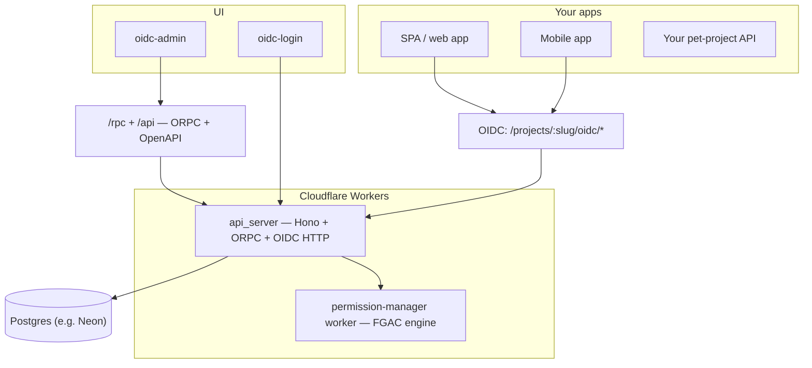
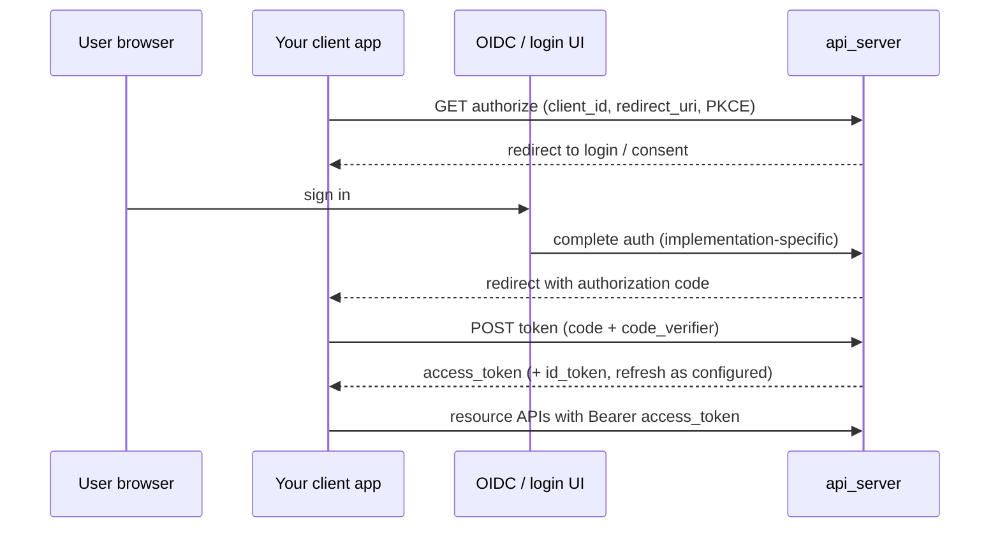

# OIDC workspace (experimental)

This repo is an **experimental** playground: a small, self-hosted stack to **reuse across pet projects** so each app does not reinvent sign-in, API clients, and permission rules. The goal is **one place** for **authentication** and **authorization**, with a admin UI to configure it.

It is not a production SLA product. APIs, schema, and UX may change without notice(Vibe Coded).

### Deployed

| App | URL |
| --- | --- |
| Hosted login (`oidc-login`) | https://oidclogin.shafi.dev |
| Admin (`oidc-admin`) | https://oidcadmin.shafi.dev |

---

## Why this exists

Pet projects usually need the same building blocks: user accounts, OAuth/OIDC for SPAs or mobile apps, scoped API access, and some notion of “can Alice edit this document?”. Wiring a third-party IdP plus a separate permissions system each time is slow and splits your mental model.

This workspace keeps **identity and permissions beside each other**: projects, OIDC clients, scope sets, and a **fine-grained access** layer (relations on typed “documents”) so your apps can align on one issuer and one permission vocabulary.

---

## What you get

### Authentication (who)

- **OIDC** per project: discovery, JWKS, authorization endpoint, token endpoint (e.g. authorization code + **PKCE**), userinfo-style claims in issued tokens.
- **Project-scoped** endpoints under `/projects/:slug/...`, plus optional **global aliases** resolved via a default project slug (see `apps/backend/api_server/README.md`).
- **Hosted-style login** can be pointed at via env (`OIDC_HOSTED_LOGIN_URL`); example UIs live under `apps/webapp/oidc-login` and `apps/mobile/oidc_login_demo`.

### Authorization (what)

- **FGAC-style** model: **doc types** (e.g. `project`, `client`, `user`, plus custom types), **relations** (e.g. `viewer`, `editor`, `owner`), each with **permissions** and optional **inheritance** between relations.
- **Grants** tie **subjects** (`user:…`, `group:…`, and room for `api_key:…`) to resources; APIs exist to check and manage them.
- **Admin panel** (`apps/webapp/oidc-admin`) for members, clients, scope sets, and the permission graph.
- **Project API keys** (scoped, revocable) for **machine-readable** exports such as the FGAC schema (`read_fgac_schema`), so integrations can mirror your model without a user session.

---

## How it fits together

- **api_server** holds users, projects, OIDC clients, codes/tokens, and orchestrates permission checks.
- **permission-manager** is a separate Worker binding (`PERMISSION_MANAGER`) that runs the heavy FGAC logic your API calls into.
- **oidc-admin** talks to the API over **ORPC** (`/rpc`) with session cookies + CSRF for writes.

---

## Typical sign-in flow (simplified)

Your pet app treats the platform as the **issuer**: validate JWTs (JWKS), read `sub`/claims, and optionally call permission APIs or replicate rules using the **FGAC schema export** for offline policy.

---

## Repository layout (high level)

| Path                             | Role                                               |
| -------------------------------- | -------------------------------------------------- |
| `apps/backend/api_server`        | Main Worker: OIDC routes, admin ORPC, Drizzle + DB |
| `apps/backend/worker/permission` | FGAC Worker consumed by the API                    |
| `apps/webapp/oidc-admin`         | Admin UI: projects, members, clients, permissions  |
| `apps/webapp/oidc-login`         | Example hosted login / redirect bridge             |
| `apps/webapp/oidc-spa-example`   | Example SPA + tiny resource server                 |
| `apps/mobile/oidc_login_demo`    | Flutter demo client                                |
| `packages/ts/*`                  | Shared TS utilities (e.g. ORPC / OpenAPI helpers)  |

---

## Decisions (short rationale)

| Decision                      | Rationale                                                                                                        |
| ----------------------------- | ---------------------------------------------------------------------------------------------------------------- |
| **OIDC**                      | Standard protocol; any mature HTTP client or OIDC library can integrate without custom auth protocols.           |
| **Projects**                  | Multi-tenant boundary: each pet app (or env) can be a project with its own clients, scopes, and FGAC graph.      |
| **FGAC-style graph**          | RBAC-only roles are often too coarse; relations + inheritance map better to “editor implies viewer” style rules. |
| **Workers + service binding** | Split permission evaluation behind a stable RPC surface so the main API stays thin and deployable independently. |
| **ORPC for admin**            | Typed procedures for the control plane; same router can expose **OpenAPI** for HTTP clients and docs.            |

---

## Running and configuring

See **`apps/backend/api_server/README.md`** for canonical OIDC paths, admin auth routes, env vars (`OIDC_DEFAULT_PROJECT_SLUG`, `ADMIN_ALLOWED_ORIGINS`, cookie domain notes for CSRF, etc.), and Wrangler/Drizzle commands.

---

## Experimental caveat

Use this to **bootstrap ideas** and small apps. Before anything serious: threat model, token lifetimes, audit logging, backup/restore, and hardening of login and admin surfaces are on you. Issues and breaking changes are expected while the design settles.
