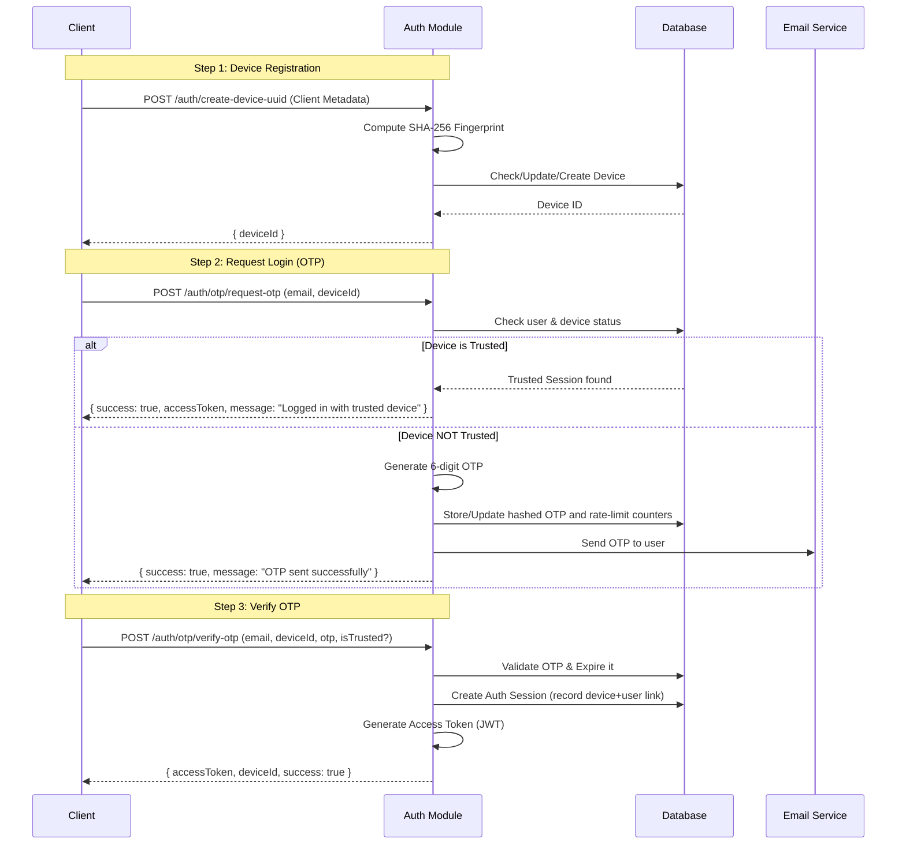

# Current Authentication Flow

The system uses a custom OTP-based authentication mechanism combined with device fingerprinting and JWT session management.

## Key Components

1.  **Device Fingerprinting**: Generates a unique `fingerprint` from client metadata (IP, OS, Model, etc.) to track devices.
2.  **OTP Lifecycle**: Handles generation, storage, and validation of one-time passwords via email.
3.  **Auth Sessions**: Tracks active logins per device. Supports "trusted" devices that can skip OTP for future logins.
4.  **JWT Handling**: Issues short-lived access tokens.

## Sequence Diagram

## Session Management

- **Sliding Window**: Tokens can be refreshed via `POST /auth/refresh-token` as long as the auth session in the DB is active and hasn't exceeded the max valid time (7 days).
- **Concurrency**: By default, limited to **1 active device** per user (configurable in `AuthService`).
- **Trusted Devices**: If a user marks a device as trusted (`isTrusted: true`) during verification, subsequent login requests from that same device ID will bypass OTP and issue a token immediately.
